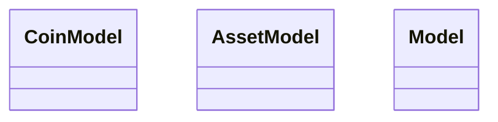

# Domain Entities & Data Transfer Objects

<!-- sdd-knowledge-generated -->

## Domain Entities

| Entity | Type | File | Line |
|--------|------|------|------|
| CoinModel | class | `validation/info/model.go` | 4 |
| AssetModel | class | `validation/info/model.go` | 18 |
| Model | class | `validation/list/model.go` | 4 |
| Model | class | `validation/tokenlist/model.go` | 6 |

### Entity Relationships

## DTOs, Requests & Responses

| Name | Type | Role | File | Line |
|------|------|------|------|------|
| GetHTTPResponse | function | Response | `http/http.go` | 10 |
| TRC10TokensResponse | class | Response | `validation/info/external/trc10.go` | 12 |
| TRC20TokensResponse | class | Response | `validation/info/external/trc20.go` | 12 |

