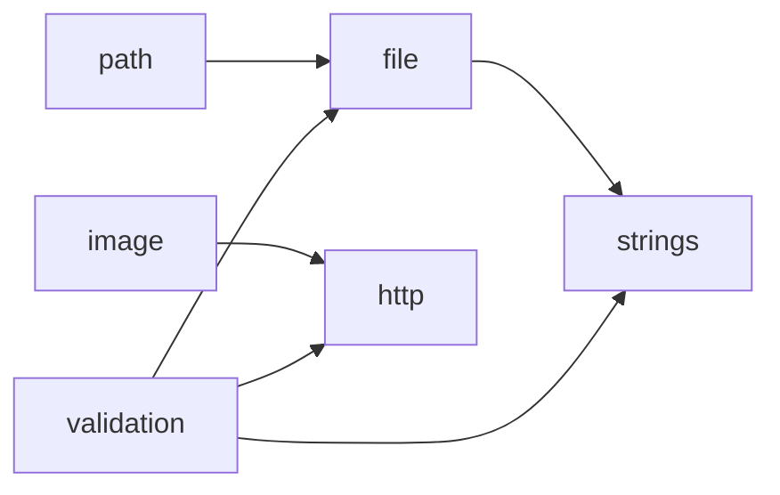

# Dependency Graph

<!-- sdd-knowledge-generated -->

## Feature Dependencies

## External Dependencies

| Package | Import Count |
|---------|--------------|
| `github.com` | 14 |
| `golang.org` | 1 |

## See Also
- [image](../features/image.md) <!-- rel:strong -->
- [path](../features/path.md) <!-- rel:strong -->
- [client](../features/client.md) <!-- rel:strong -->
- [overview](../build/overview.md) <!-- rel:strong -->
- [file](../features/file.md) <!-- rel:strong -->
