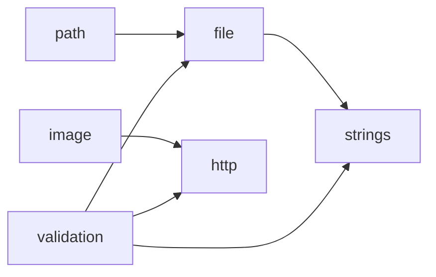

# Dependency Graph

<!-- sdd-knowledge-generated -->

## Feature Dependencies

## External Dependencies

| Package | Import Count |
|---------|--------------|
| `github.com` | 14 |
| `golang.org` | 1 |

