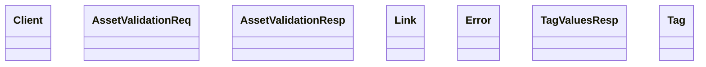

# Client

<!-- sdd-knowledge-generated -->

## Overview

- **Files**: 2
- **Symbols**: 10

## Files

- `client/assets-manager/client.go` — Client, InitClient, ValidateAssetInfo, GetTagValues
- `client/assets-manager/model.go` — AssetValidationReq, AssetValidationResp, Link, Error, TagValuesResp, Tag

## Class Diagram

## External Dependencies

- `github.com`

## Minimum Viable Specification

> Auto-generated specification for the **Client** feature.

**Key Types**: Client, AssetValidationReq, AssetValidationResp, Link, Error, TagValuesResp, Tag

## See Also
- [client domain](../architecture/client-domain.md) <!-- rel:strong -->
- [models](../architecture/data/models.md) <!-- rel:strong -->
- [dependency graph](../architecture/dependency-graph.md) <!-- rel:strong -->
- [entities](../architecture/data/entities.md) <!-- rel:related -->
- [validation domain](../architecture/validation-domain.md) <!-- rel:related -->
