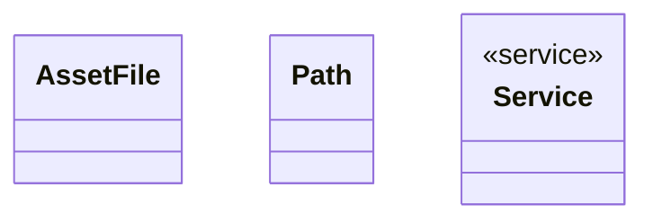

# File

<!-- sdd-knowledge-generated -->

## Overview

- **Files**: 7
- **Symbols**: 28
- **Services**: Service, NewService

## Files

- `file/asset_file.go` — AssetFile, NewAssetFile, Path, Type, Chain, Asset
- `file/files.go` — Exists, CreateDirPath, CreateFileWithPath, ReadDir
- `file/json_test.go`
- `file/json.go` — PrepareJSONData, CreateJSONFile, ReadJSONFile, FormatJSONFile
- `file/path.go` — GetRegexMap, Path, NewPath, Type, String, Chain, Asset, defineFileType, ReadLocalFileStructure
- `file/service.go` — Service, NewService, GetAssetFile, UpdateFile, getFile
- `file/types.go`

## Architecture

### Layers

**Service**: `Service`, `NewService`

**Other**: `AssetFile`, `NewAssetFile`, `Path`, `Type`, `Chain`, `Asset`, `Exists`, `CreateDirPath`, `CreateFileWithPath`, `ReadDir`, `PrepareJSONData`, `CreateJSONFile`, `ReadJSONFile`, `FormatJSONFile`, `GetRegexMap`, `Path`, `NewPath`, `Type`, `String`, `Chain`, `Asset`, `defineFileType`, `ReadLocalFileStructure`, `GetAssetFile`, `UpdateFile`, `getFile`

## Class Diagram

## External Dependencies

- `github.com`

## Minimum Viable Specification

> Auto-generated specification for the **File** feature.

**Key Types**: AssetFile, Path, Service

## See Also
- [file domain](../architecture/file-domain.md) <!-- rel:strong -->
- [call graph](../architecture/call-graph.md) <!-- rel:strong -->
- [models](../architecture/data/models.md) <!-- rel:related -->
- [dependency graph](../architecture/dependency-graph.md) <!-- rel:weak -->
- [validate asset explain](../architecture/validate-asset-explain.md) <!-- rel:weak -->
