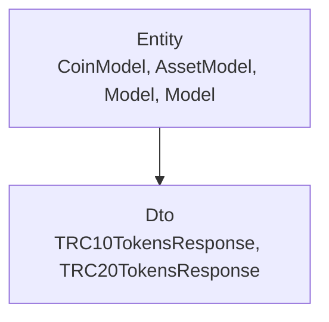

# Validation

<!-- sdd-knowledge-generated -->

## Overview

- **Files**: 19
- **Symbols**: 77
- **Entities**: CoinModel, AssetModel, Model, Model
- **DTOs**: TRC10TokensResponse, TRC20TokensResponse

## Files

- `validation/address.go` — ValidateAssetAddress, ValidateValidatorsAddress, ValidateTezosAddress, ValidateTronAddress, ValidateWavesAddress, ValidateETHForkAddress, ValidateAddress, IsEthereumAddress
- `validation/bytes.go` — ValidateJSON, checkDuplicateKey
- `validation/errors.go` — NewErrComposite, ErrComposite, Len, Error, Append, GetErrors
- `validation/file.go` — ValidateHasFiles, ValidateAllowedFiles, ValidateFileInPR, ValidateLowercase, ValidateExtension
- `validation/image.go` — ValidatePngImageDimensionForCI, ValidatePngImageDimension, ValidateImageDimension, ValidateLogoFileSize, ValidateLogoStreamSize, validateLogoSize
- `validation/info/asset.go` — ValidateAsset
- `validation/info/coin.go` — ValidateCoin
- `validation/info/external/erc20.go` — TokenInfoERC20, GetTokenInfoForERC20
- `validation/info/external/external.go` — TokenInfo, GetTokenInfo, GetTokenInfoByScraping
- `validation/info/external/spl.go` — TokenInfoSPL, Data, GetTokenInfoForSPL
- `validation/info/external/trc10.go` — TRC10TokensResponse, GetTokenInfoForTRC10
- `validation/info/external/trc20.go` — TRC20TokensResponse, GetTokenInfoForTRC20
- `validation/info/fields_validators.go` — ValidateAssetRequiredKeys, ValidateAssetType, ValidateAssetID, ValidateAssetDecimalsAccordingType, ValidateCoinRequiredKeys, ValidateLinks, ValidateCoinType, ValidateTags, ValidateDecimals, ValidateStatus, ValidateDescription, ValidateDescriptionWebsite, ValidateExplorer, isEmpty
- `validation/info/model.go` — CoinModel, AssetModel, Link, GetStatus
- `validation/info/values.go` — explorerURLAlternatives, linkNameAllowed, supportedLinkNames
- `validation/list/model.go` — Model, Staking, Payout, Status
- `validation/list/validator.go` — ValidateList, validateRequiredFields
- `validation/tokenlist/model.go` — Model, Token, Pair, Version
- `validation/tokenlist/validator.go` — ValidateTokenList, validateChainOrAssetInfo, validateTokenListPairs, validateTokenAddress, validateAssetID

## Architecture

### Layers

**Entity**: `CoinModel`, `AssetModel`, `Model`, `Model`

**Dto**: `TRC10TokensResponse`, `TRC20TokensResponse`

**Other**: `ValidateAssetAddress`, `ValidateValidatorsAddress`, `ValidateTezosAddress`, `ValidateTronAddress`, `ValidateWavesAddress`, `ValidateETHForkAddress`, `ValidateAddress`, `IsEthereumAddress`, `ValidateJSON`, `checkDuplicateKey`, `NewErrComposite`, `ErrComposite`, `Len`, `Error`, `Append`, `GetErrors`, `ValidateHasFiles`, `ValidateAllowedFiles`, `ValidateFileInPR`, `ValidateLowercase`, `ValidateExtension`, `ValidatePngImageDimensionForCI`, `ValidatePngImageDimension`, `ValidateImageDimension`, `ValidateLogoFileSize`, `ValidateLogoStreamSize`, `validateLogoSize`, `ValidateAsset`, `ValidateCoin`, `TokenInfoERC20`, `GetTokenInfoForERC20`, `TokenInfo`, `GetTokenInfo`, `GetTokenInfoByScraping`, `TokenInfoSPL`, `Data`, `GetTokenInfoForSPL`, `GetTokenInfoForTRC10`, `GetTokenInfoForTRC20`, `ValidateAssetRequiredKeys`, `ValidateAssetType`, `ValidateAssetID`, `ValidateAssetDecimalsAccordingType`, `ValidateCoinRequiredKeys`, `ValidateLinks`, `ValidateCoinType`, `ValidateTags`, `ValidateDecimals`, `ValidateStatus`, `ValidateDescription`, `ValidateDescriptionWebsite`, `ValidateExplorer`, `isEmpty`, `Link`, `GetStatus`, `explorerURLAlternatives`, `linkNameAllowed`, `supportedLinkNames`, `Staking`, `Payout`, `Status`, `ValidateList`, `validateRequiredFields`, `Token`, `Pair`, `Version`, `ValidateTokenList`, `validateChainOrAssetInfo`, `validateTokenListPairs`, `validateTokenAddress`, `validateAssetID`

### Data Flow

## Class Diagram

```mermaid
classDiagram
  class ErrComposite {
  }
  class TokenInfoERC20 {
  }
  class TokenInfo {
  }
  class TokenInfoSPL {
  }
  class Data {
  }
  class TRC10TokensResponse {
    <<dto>>
  }
  class TRC20TokensResponse {
    <<dto>>
  }
  class CoinModel {
    <<entity>>
  }
  class AssetModel {
    <<entity>>
  }
  class Link {
  }
  class Model {
    <<entity>>
  }
  class Staking {
  }
  class Payout {
  }
  class Status {
  }
  class Token {
  }
  class Pair {
  }
  class Version {
  }
```

## External Dependencies

- `github.com`

## Minimum Viable Specification

> Auto-generated specification for the **Validation** feature.

**Domain Model**: CoinModel, AssetModel, Model, Model

**Contracts**: TRC10TokensResponse, TRC20TokensResponse

**Key Types**: ErrComposite, TokenInfoERC20, TokenInfo, TokenInfoSPL, Data, TRC10TokensResponse, TRC20TokensResponse, CoinModel, AssetModel, Link, Model, Staking, Payout, Status, Model, Token, Pair, Version

